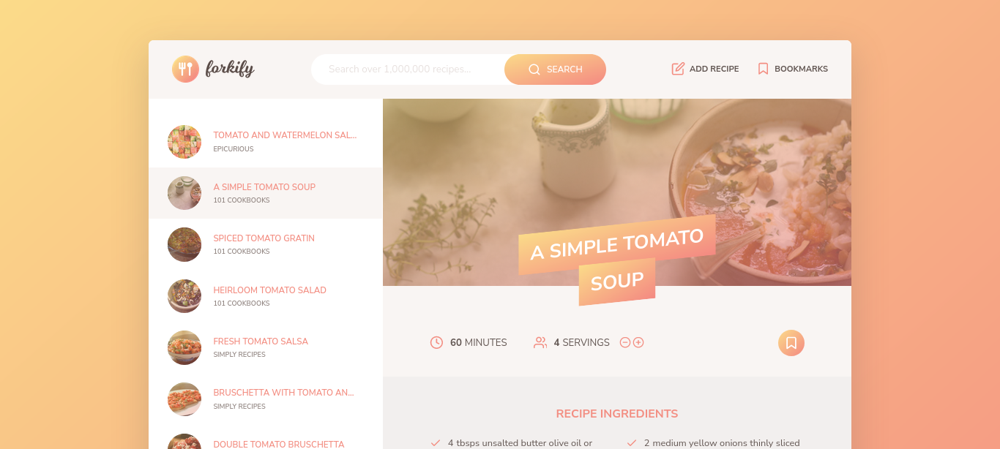

<h1 align="center">Forkify App</h1>
<p align="center">
    
 </p>

<p align="center">
  
  <a href="https://forkify-app.netlify.app/" target="_blank">
    
  </a>
  <a href="https://github.com/CodePapa360/Forkify-Recipe-App#readme" target="_blank">
    
  </a>
  <a href="https://github.com/CodePapa360/Forkify-Recipe-App/graphs/commit-activity" target="_blank">
    
  </a>
  <a href="https://github.com/CodePapa360/Forkify-Recipe-App/blob/master/LICENSE" target="_blank">
    
  </a>
  <a href="https://twitter.com/CodePapa360" target="_blank">
    
  </a>
</p>

<h2 align="center">
Check out the <a href="https://your-demo-link.com" target="_blank">live demo of Forkify here</a>.
</h2>
</br>

<p align="center">
  
</p>


## Flowchart

<p align="center">
  
</p>


## Recipe Loading Architecture

<p align="center">
  
</p>

## Install

```sh
npm install
```

## Usage

```sh
npm start
```

## Author

<b>👤 Alamin</b>

- LinkedIn - [@CodePapa360](https://www.linkedin.com/in/codepapa360)
- Twitter - [@CodePapa360](https://www.twitter.com/CodePapa360)
- Frontend Mentor - [@CodePapa360](https://www.frontendmentor.io/profile/CodePapa360)
- Github: [@CodePapa360](https://github.com/codepapa360)

Feel free to contact me with any questions or feedback!

## Show your support

Give a ⭐️ if this project helped you!

## 📝 License

This project is [MIT](https://github.com/codepapa360/Forkify-Recipe-App/blob/master/LICENSE) licensed.
